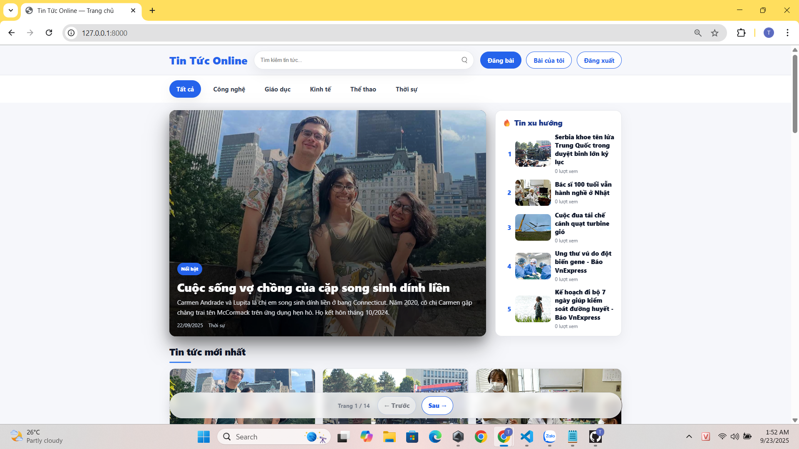
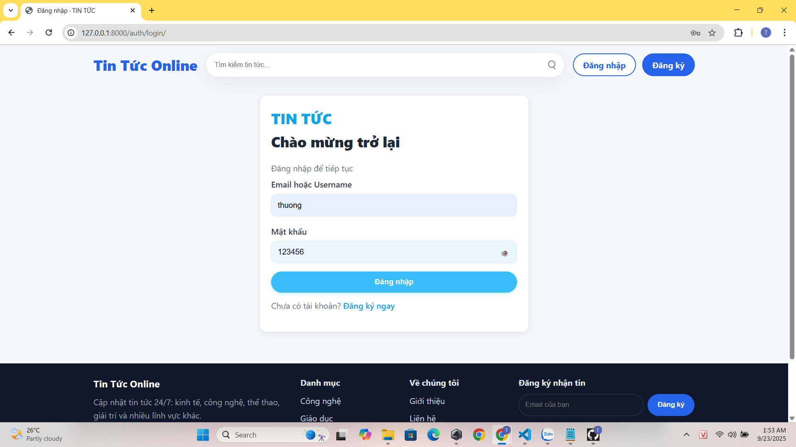
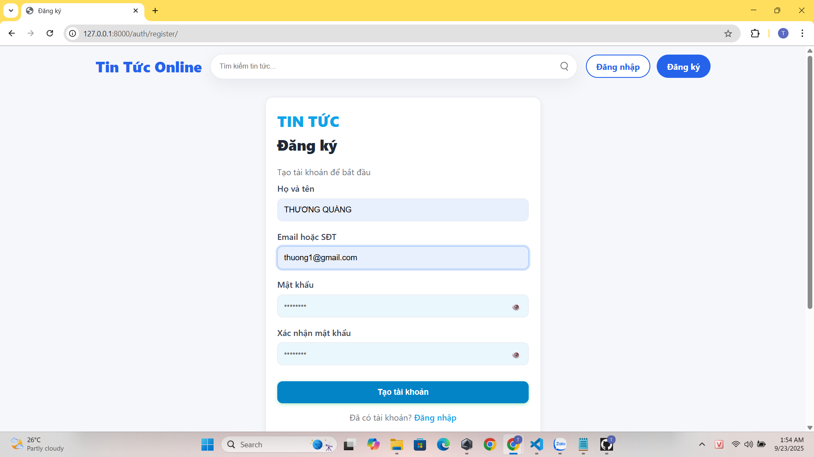
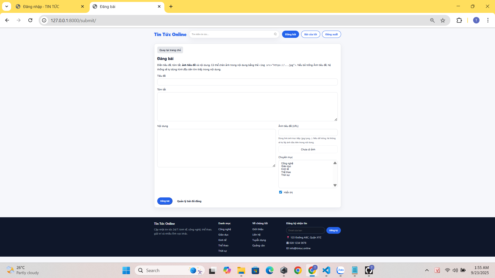
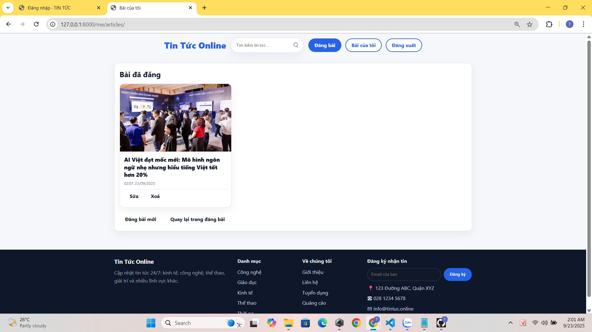

# 📖 Tỉn Tuc Online  – Django All-in-One News Aggregator

## Demo giao diện

### 1. Trang chủ



### 2. Đăng nhập



### 3. Đăng ký



### 4. Đăng bài



### 5. Bài của tôi



## 1. Giới thiệu

VN News là một dự án **thu thập và hiển thị tin tức từ nhiều nguồn báo chí Việt Nam**, phát triển bằng **Django All-in-One** (Django + Celery + Redis + PostgreSQL/SQLite).

Hệ thống có thể:

- Chạy nhanh ở **dev mode** (không cần worker, crawl đồng bộ).
- Chạy ổn định ở **prod mode** (Celery worker + Redis, crawl định kỳ).

---

## 2. Kiến trúc & Công nghệ

- **Django**: ORM, template engine, admin, management commands
- **Database**: PostgreSQL (production) / SQLite (dev)
- **Celery + Redis**: xử lý tác vụ nền (crawl RSS, fetch HTML, làm sạch dữ liệu)
- **Requests + Feedparser + Trafilatura**: tải RSS, parse/trích xuất nội dung HTML
- **BeautifulSoup + Bleach**: sanitize & định dạng HTML
- **Whitenoise + Gunicorn**: phục vụ static file & production server
- **Django Template Engine**: giao diện thuần HTML/CSS (có thể kết hợp HTMX)

---

## 3. Cấu trúc thư mục

```text
.vscode/settings.json         # VSCode config
celerybeat-schedule.*         # Celery Beat state files
db.sqlite3                    # SQLite database (dev)
manage.py                     # Django management script
requirements.txt              # Python dependencies

articles/                     # App quản lý bài viết
  ├── models.py               # Article model
  ├── views.py, admin.py      # Views & Admin
  └── migrations/             # Schema migrations

crawler/                      # App crawler
  ├── tasks.py                # Celery tasks (fetch_feed, fetch_article)
  ├── utils.py                # Hàm fetch_and_extract
  ├── management/commands/    # CLI: crawl_now, crawl_once, seed_sources…
  └── migrations/

sources/                      # App quản lý nguồn
  ├── models.py               # Source, Category
  └── admin.py, migrations/

web/                          # App giao diện
  ├── views.py                # Home, Category, ArticleDetail
  ├── models.py               # Comment, Reaction
  └── templates/              # HTML templates
       ├── base.html
       ├── home.html
       ├── category.html
       └── article_detail.html

vnnews/                       # Project config
  ├── settings.py             # Django settings
  ├── urls.py                 # URL routes
  ├── celery.py               # Celery app & schedule
  ├── wsgi.py / asgi.py       # Entrypoints
```

---

## 4. Mô hình dữ liệu

### Source

- `name`, `homepage`, `rss_url`
- `is_active`, `source_score`, `crawl_interval_min`, `last_crawled_at`

### Article

- `source` (FK → Source)
- `title`, `slug`, `source_url`
- `excerpt`, `content_html`, `blocks (JSON)`
- `main_image_url`, `main_image_caption`
- `published_at`, `fetched_at`
- `is_visible`, `search_blob` (tìm kiếm bỏ dấu)

### Category

- `name`, `slug`

### Comment, Reaction

- Gắn với `Article`
- `Reaction.value`: `like`, `love`, `wow`, `sad`, `angry`

---

## 5. Cài đặt & Chạy (DEV – không cần Redis/Celery)

> Mục tiêu: chạy bằng **SQLite** + **crawl đồng bộ (sync)**, **không cần Redis/Celery**.
> Làm theo thứ tự từng bước dưới đây.

### 5.1. Yêu cầu hệ thống

- **Python 3.10+**, **Git**, **pip**
- Khuyến nghị dùng **venv** để cô lập môi trường
- **KHÔNG cần** PostgreSQL/Redis cho DEV

---

### 5.2. Clone repo & tạo môi trường ảo

```bash
# Clone
git clone https://github.com/trchitho/news_crawler.git
cd news_crawler

# Tạo venv
# Linux/macOS:
python3 -m venv .venv && source .venv/bin/activate

# Windows PowerShell:
python -m venv .venv
.\.venv\Scripts\Activate.ps1
```

> ⚠️ Nếu PowerShell chặn script: mở PowerShell **Run as Administrator** và chạy
> `Set-ExecutionPolicy -ExecutionPolicy RemoteSigned -Scope CurrentUser`

---

### 5.3. Cài thư viện Python

```bash
# Nâng pip + công cụ build (đặc biệt trên Windows)
python -m pip install --upgrade pip setuptools wheel

# Cài dependencies của dự án
pip install -r requirements.txt
```

> Nếu chạy crawl bị báo thiếu gói (ví dụ `feedparser`), cài bổ sung:
> `pip install feedparser requests bleach beautifulsoup4 trafilatura readability-lxml django-taggit`

---

### 5.4. Tạo file cấu hình môi trường `.env`

Tạo file `.env` ở thư mục gốc (có thể copy từ `.env.example` nếu sẵn):

```env
# Django
DEBUG=True
SECRET_KEY=change-me
ALLOWED_HOSTS=127.0.0.1,localhost
TIME_ZONE=Asia/Ho_Chi_Minh

# Database (DEV dùng SQLite)
DATABASE_URL=sqlite:///db.sqlite3

# Redis (KHÔNG cần cho DEV sync)
REDIS_URL=redis://localhost:6379/0
```

> Đảm bảo `vnnews/settings.py` **có đọc `.env`** (vd: dùng `django-environ`).
> Nếu chưa: thêm đoạn khởi tạo environ để load `.env`.

---

### 5.5. Khởi tạo CSDL & seed nguồn

```bash
# Tạo schema DB
python manage.py migrate

# (Tuỳ chọn) tạo tài khoản admin để vào /admin
python manage.py createsuperuser

# Nạp danh sách nguồn RSS (idempotent)
python manage.py seed_sources
```

> Nếu Django báo: **models thay đổi nhưng chưa có migration**, hãy chạy:
>
> ```bash
> python manage.py makemigrations web
> # nếu sửa nhiều app:
> python manage.py makemigrations web articles sources
> python manage.py migrate
> ```

---

### 5.6. Crawl dữ liệu mẫu (đồng bộ – không Celery)

```bash
# Lấy ~30 bài mới từ các nguồn RSS (SYNC)
python manage.py crawl_now --limit 30
```

> Lệnh này **KHÔNG dùng Celery**, giúp có dữ liệu ngay để test UI.

---

### 5.7. Chạy web server (DEV)

```bash
python manage.py runserver
```

- App: [http://127.0.0.1:8000](http://127.0.0.1:8000)
---

### 5.8. Lệnh hữu ích trong DEV

```bash
# Kiểm tra cấu hình Django
python manage.py check

# Rebuild search_blob (tìm kiếm bỏ dấu)
python manage.py reindex_search

# Crawl một URL cụ thể (debug)
python manage.py crawl_once "https://.../bai-bao.html"

# (Chỉ khi dùng Celery – không áp dụng cho DEV sync)
python manage.py crawl_recent --hours 2
```

---

## 6. Luồng Hoạt Động

1. **Seed Sources** → DB lưu danh sách RSS
2. **(DEV sync)**: `crawl_now` gọi trực tiếp hàm fetch & lưu `Article` (**không cần Celery**)
3. **(Prod)**: Celery Beat (2h/lần) → `schedule_all_sources` → `task_fetch_feed(source_id)` → `task_fetch_article(url)`
4. `task_fetch_article` → tải HTML, sanitize, trích xuất title/excerpt/image/content → lưu `Article`
5. **Web App** → `HomeView` (bài mới), `CategoryView` (lọc), `ArticleDetailView` (chi tiết + comment + reaction)

---

## 7. Giao diện

- **base.html**: header, nav categories, search box,footer
- **home.html**: lưới card (ảnh, tiêu đề, excerpt, meta)
- **category.html**: danh sách bài theo danh mục
- **article_detail.html**: nội dung sạch (HTML safe), ảnh, caption, reactions, comment box, related articles
